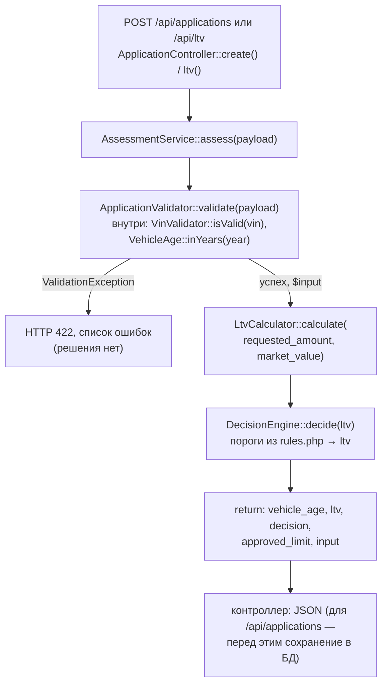

# Карта кода: как считается решение approve / review / reject

## Участвующие файлы

| Файл | Роль |
|---|---|
| `backend/config/rules.php` | Справочник порогов: VIN, возраст/пробег авто, сумма, срок, LTV, `ltv_by_age` |
| `backend/src/Domain/AssessmentService.php` | Оркестратор: валидация → LTV → решение → лимит |
| `backend/src/Domain/ApplicationValidator.php` | Валидация входа, нормализация полей |
| `backend/src/Domain/VinValidator.php` | Формат VIN |
| `backend/src/Domain/VehicleAge.php` | Возраст авто в годах (текущий год минус год выпуска) |
| `backend/src/Domain/LtvCalculator.php` | LTV в процентах |
| `backend/src/Domain/DecisionEngine.php` | Единственное место, где рождается `approve`/`review`/`reject` |
| `backend/src/Domain/ValidationException.php` | Переносит ошибки валидации (`поле => сообщение`) |

Обвязка вне Domain: `AppFactory::create()` (`backend/src/AppFactory.php`, строки 30–39) собирает объекты и передаёт им значения из `rules.php`; `ApplicationController::create()` и `ltv()` (`backend/src/Http/ApplicationController.php`) — точки входа.

## Порядок вызовов



1. **`AssessmentService::assess($payload)`** (строки 28–42) — начало.
2. **`ApplicationValidator::validate($payload)`** — по очереди:
   - `VinValidator::isValid()`: длина 17, `A–Z0–9`, без `I/O/Q` (из `rules['vin']`);
   - год: не раньше 1990, не из будущего, возраст ≤ 20 лет (`rules['vehicle']`, возраст через `VehicleAge::inYears()`);
   - пробег: 0…500 000 км (`rules['vehicle']['max_mileage_km']`);
   - `market_value` > 0; сумма 50 000…2 000 000 (`rules['amount']`); срок 3…48 мес. (`rules['term']`).
   - Любая ошибка → `ValidationException` → контроллер возвращает **422**. То есть невалидная заявка решения не получает вовсе — это не `reject`.
3. **`LtvCalculator::calculate(requested_amount, market_value)`** — `round(сумма / стоимость × 100, 2)`; нулевые значения отсеяны ещё валидатором.
4. **`DecisionEngine::decide($ltv)`** (строки 30–41), пороги приходят из `rules['ltv']` через конструктор (`approve_max = 60.0`, `review_max = 85.0`):
   - `ltv < 60.0` → `approve`;
   - `60.0 <= ltv <= 85.0` → `review`;
   - `ltv > 85.0` → `reject`.

   Замечание, отмечаю как факт: комментарий в `rules.php` (строки 38–42) и docblock `DecisionEngine` пишут «`LTV <= approve_max -> approve`», но в коде — строгое `<` (строка 32). LTV ровно 60.0 даёт `review`, а не `approve`.
5. **Возврат из `assess()`**: `vehicle_age` (снова `VehicleAge::inYears`), `ltv`, `decision`, `approved_limit` (запрошенная сумма при `approve`, иначе 0), `input`. Лимит по справочнику `ltv_by_age` **не считается** — в коде и `rules.php` (строки 48–52) прямо указано: это задача LOAN-12.
6. **Контроллер**: для `/api/ltv` — сразу JSON; для `/api/applications` — сохранение через `ApplicationRepository` (в т.ч. пробег в колонку `mileage_km`) и JSON c кодом 201.

## Куда встаёт правило «пробег ≤ 400 000 км, иначе review»

**Функция: `DecisionEngine::decide()`** (`backend/src/Domain/DecisionEngine.php`, строки 30–41) — сейчас решение является функцией **только от LTV**, и это единственный класс с логикой решения. Точка вызова — `AssessmentService::assess()`, строка 33: `$decision = $this->decisionEngine->decide($ltv);`.

Что потребуется:

1. **Порог в `rules.php`** — числа не хардкодим (правило проекта). Значения 400 000 в конфиге **нет**; `max_mileage_km => 500000` — это верхняя граница *валидации*, а не порог решения. Нужен отдельный ключ.
2. **Конструктор `DecisionEngine`** — сейчас принимает только `$rules['ltv']` (`AppFactory::create()`, строка 37: `new DecisionEngine($rules['ltv'])`). Новый порог надо тоже передать сюда.
3. **Сигнатура `decide(float $ltv)`** — пробег не принимает. Расширить, например до `decide(float $ltv, int $mileage)`, и в строке 33 `AssessmentService` передать `$input['mileage']`.

Место внутри `decide()` зависит от семантики, которая в коде нигде не зафиксирована (открытый вопрос):

- если `review` по пробегу должен перекрывать всё, включая `reject` по LTV, — проверка пробега первой, до LTV-сравнений;
- если правило только «понижает» `approve` до `review` (а `reject` остаётся `reject`) — после вычисления решения по LTV: `if ($decision === self::APPROVE && $mileage > $порог) return self::REVIEW;`.

Следствие, менять ничего не надо: при `review` поле `approved_limit` уже автоматически станет 0 (строка 39 `AssessmentService`). Альтернативное место — скорректировать `$decision` в `AssessmentService::assess()` после строки 33, но тогда логика решения расползается между двумя классами.

**Важное пересечение с валидацией.** Валидатор уже сейчас отсекает пробег > 500 000 → 422 без всякого решения. Значит новое правило фактически сработает только в диапазоне 400 001–500 000. Если нужно, чтобы «иначе review» действовало для *любого* пробега свыше 400 000, придётся дополнительно менять `max_mileage_km` в `rules.php` — сейчас заявки с пробегом 500 001+ до решения просто не доходят.

**Данные, которые уже есть:**

- поле `mileage` отправляется фронтендом (`frontend/index.html`, input type=number);
- валидатор нормализует его в int и возвращает в `$input['mileage']` (строки 43–46, 78) — оно уже доступно прямо в `AssessmentService::assess()` на момент вызова `decide()`;
- репозиторий сохраняет его в `mileage_km` (`db/schema.sql`, строка 22).

**Чего не хватает:** порога 400 000 в `rules.php` (нет), передачи пробега в `DecisionEngine` через конструктор и сигнатуру (нет), определённого приоритета «review по пробегу vs reject по LTV» (нигде не зафиксировано). Тестов на правило пробега тоже нет — в `tests/` mileage встречается только как валидное значение в фикстурах (96 000 и 84 000).

## Что уже сейчас проверяется про пробег

Единственное место — **`ApplicationValidator::validate()`, строки 43–46**:

```php
$mileage = (int) ($payload['mileage'] ?? -1);
if ($mileage < 0 || $mileage > $this->rules['vehicle']['max_mileage_km']) {
    $errors['mileage'] = sprintf('Пробег от 0 до %d км', ...);
}
```

То есть: целое число от 0 до 500 000 (граница из `rules['vehicle']['max_mileage_km']`); отсутствие поля трактуется как −1 и даёт ошибку. Это проверка *валидности входа*, а не решения.

Больше про пробег нигде не проверяется: в `LtvCalculator` — нет, в `DecisionEngine` — нет, в `ltv_by_age` — нет (это возраст, не пробег), на решение и лимит пробег не влияет — нет.